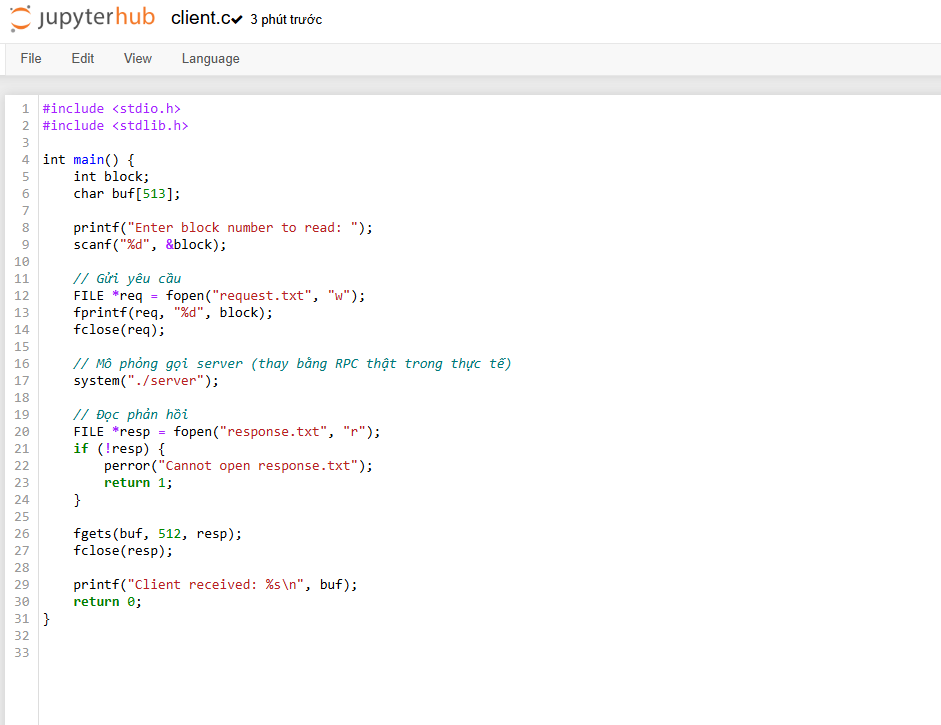
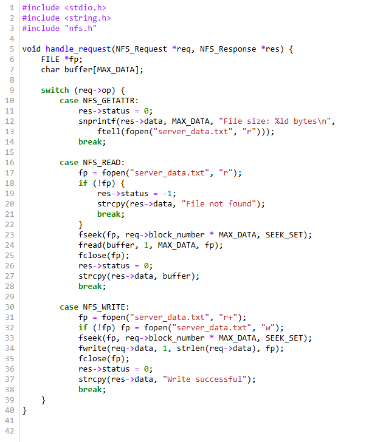

# Code thử nghiệm cho Chapter 49

## 49.1. A Basic Distributed File System
.
.
.
> Mô tả: 
**Mô phỏng:** RPC đơn giản để client gửi yêu cầu đọc block từ file ở server.
**Chi tiết:**
  - Server có `server_data.txt`.
  - Client gửi block số N.
  - Server đọc và trả lại dữ liệu.
**Kết quả:**  
  Client nhận đúng dữ liệu.  
 *Giao tiếp mạng cơ bản, tương đương NFS read từ xa.*

---

## 49.2. On To NFS

> Mô tả: 
**Mô phỏng:** POSIX `read(fd, buf, size)` gọi đến RPC `nfs_read(...)`.
**Chi tiết:**
  - Client gọi `read()`.
  - `read()` gọi `nfs_read()` dưới tầng RPC.
**Kết quả:**  
  Tách biệt API (POSIX) và thực thi (RPC từ xa).  
  *Giới thiệu lớp NFS giả lập POSIX.*

---
## 49.3. imple and Fast Crash Recovery

> Mô tả: 
**Mô phỏng:** Server crash, restart → không nhớ trạng thái.
**Chi tiết:**
  - Client gửi request đọc sau khi server bị “restart”.
  - Server xử lý như bình thường.
**Kết quả:**  
  Client vẫn nhận được block đúng.  
   *NFS stateless giúp recover nhanh sau crash.*

---

## 49.4. Key To Fast Crash Recovery: Statelessness

> Mô tả: 
**Mô phỏng:** Client gửi đầy đủ thông tin mỗi lần (`offset`, `filename`...).
**Chi tiết:**
  - Server không lưu `open()` hay `file handle`.
  - Mỗi `read()` có đủ thông tin để xử lý độc lập.
**Kết quả:**  
  Server có thể xử lý request mà không cần nhớ lịch sử.  
  *Stateless RPC hoạt động hiệu quả hơn.*

---

## 49.5. The NFSv2 Protocol

> Mô tả: 
**Mô phỏng:** Các thủ tục RPC trong NFSv2 như:
  - `LOOKUP(filename)`
  - `READ(file_handle, offset, size)`
  - `WRITE(file_handle, offset, data)`
**Chi tiết:**
  - Client gọi các hàm giống NFSv2.
**Kết quả:**  
  Giúp hiểu cách NFS chuẩn hóa giao tiếp.  
  👉 *Cấu trúc RPC thực tế trong hệ thống file phân tán.*

---
## 49.6. From Protocol To Distributed File System

> Mô tả: 
**Mô phỏng:** POSIX `open()` → `read()` → `close()` nhưng thực tế NFS chỉ có `read()` RPC.
**Chi tiết:**
  - Client nghĩ đang làm việc với file thật.
  - Server không thực sự lưu trạng thái `open`.
**Kết quả:**  
  NFS chỉ xử lý `read` trực tiếp, không lưu trạng thái file descriptor.  
  *Giả lập POSIX trên NFS stateless.*

## 49.7. Handling Server Failure With Idempotent Ops

> Mô tả: 
**Mô phỏng:** Client gửi lại cùng một `write()` nhiều lần sau khi không nhận được ACK.
**Chi tiết:**
  - Server xử lý lại cùng request nhưng không gây lỗi hoặc trùng.
**Kết quả:**  
  Dữ liệu vẫn đúng, không nhân đôi.  
  *Nhấn mạnh tính chất idempotent trong NFS.*

## 49.8. Improving Performance: Client-side Caching

> Mô tả: 
**Mô phỏng:** Client lưu cache các block đã đọc.
**Chi tiết:**
  - Lần đầu `read()` gửi RPC.
  - Lần sau đọc lại từ cache.
**Kết quả:**  
  Tăng tốc độ, giảm lưu lượng mạng.  
  *Hiệu năng tốt hơn nhờ cache phía client.*

## 49.9. The Cache Consistency Problem

> Mô tả: 
**Mô phỏng:** Server thay đổi dữ liệu nhưng client vẫn dùng cache cũ.
**Chi tiết:**
   Client không biết server đã update file.
**Kết quả:**  
  Dữ liệu không đúng — stale cache.  
  *Minh họa vấn đề consistency.*

## 49.10  Assessing NFS Cache Consistency

> Mô tả: 
**Mô phỏng:** Client kiểm tra `last_modified` file từ server trước khi dùng cache.
**Chi tiết:**
  - Nếu không đổi: dùng cache.
  - Nếu đổi: đọc lại từ server.
**Kết quả:**  
  Cache hợp lệ hoặc bị làm mới.  
  *Giảm lỗi dữ liệu cũ, nhưng không hoàn toàn đúng với tất cả kiểu update.*

---

## 49.11 Server-side Write Buffering

> Mô tả: 
**Mô phỏng:** Server ghi `write()` vào buffer, chưa ghi xuống disk cho đến khi `flush()`.
**Chi tiết:**
  - Nếu server crash trước flush → mất dữ liệu.
**Kết quả:**  
  Cần gọi `flush()` để đảm bảo dữ liệu an toàn.  
  *Minh họa rủi ro khi write không đồng bộ.*
